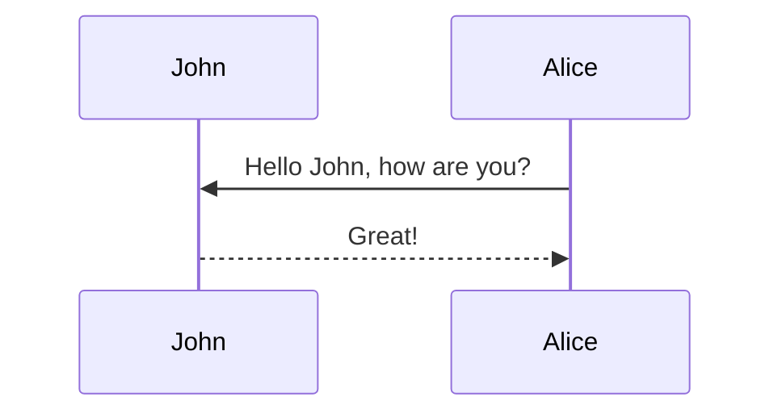

# Introduction

In this tutorial, we'll explore inference-time "plugin" methods for flow matching and rectified flow generative models like FLUX or Stable Audio Open Small. Unlike classifier-free guidance (CFG) <d-cite key="cfg"></d-cite>, which requires training the model with your desired conditioning signal, these plugin guidance methods let you add controls at inference time—even for conditions the model never saw during training.

This tutorial assumes familiarity with flow-based generative models, by which we mean "flow matching" <d-cite key="lipman2023flow"></d-cite> and/or "rectified flows" <d-cite key="rectified_flow"></d-cite>.  See the blog post ["Flow With What You Know"](https://drscotthawley.github.io/blog/posts/FlowModels.html) <d-cite key="hawley2025flowwithwhat"></d-cite> for an overview, and/or my IJCNN 2025 tutorial <d-cite key="hawley_practical"></d-cite> for further detail.
The key insight is that flow models generate samples through iterative integration, and at each step we can add small velocity corrections to steer toward specific goals. This works for various objectives: generating specific classes, filling in missing regions, or satisfying other desired constraints.

Our discussion will bring us up to date on guidance methods for latent-space rectified flow models.  While there's an extensive literature on guidance for diffusion models [@daras2024survey, @ye2024tfg] -- see Sander Dieleman's excellent blog post <d-cite key="dieleman2022guidance"></d-cite> for an overview --- flow matching allows us to cast these in a more accessible and intuitive way. There's some recent work unifying guidance for diffusion and flows <d-cite key="zander_greedy"></d-cite>, but in this tutorial we'll focus on a simplified treatment for flows only.

The paradigm of latent generative models is covered in another superb Dieleman post <d-cite key="dieleman2025latents"></d-cite>, and
combining latent-space models with flow-based guidance gives us powerful, flexible tools for adding flexible controls to efficient generation. 

Let's review the picture for flow-based generative modeling in latent space...

Let's review the picture for flow-based generative modeling in latent space...


## The Latent Flow-Matching Setup

The following diagrams illustrate the three key concepts: 

**a)** A VAE compresses pixel-space images into compact latent representations. "E" is for encoder and "D" is for decoder:





**b)** The flow model operates in this latent space, transforming noise ("Source", t=0) into structured data ("Target", t=1) through iterative integration. The decoder then converts the final latents back to pixels.




**c)** While general flows can follow curved trajectories, some of our methods will focus on flows with nearly straight trajectories
which allows for estimating endpoints without many integration steps:




These (nearly) straight trajectories can be obtained by "ReFlow" distillation of another model (covered in [@rectified_flow, @hawley2025flowwithwhat]) or by insisting during training that the models yield paths agreeing with Optimal Transport such as the "minibatch OT" method of Tong et al <d-cite key="tong2024improving"></d-cite>.  Even if the model's trajectories aren't super-straight, we'll see that the guidance methods we use can be applied fairly generally anyway. 


## Projecting and Correcting

Intuitively, guidance amounts to "steering" during the integration of the flow model in order to end up at a desired end point.  The [following video](https://bsky.app/profile/drscotthawley.bsky.social/post/3m3df2idqrc2g) provides a useful metaphor:  


The analogy's not quite right: you can't just steer, you are going to have to paddle a little bit.  In other words, you're going to have to provide a bit of a *extra velocity* to correct the where the "current" flow is taking you.


In flow matching, we go from a source data (distribution) at time $$t=0$$ to target
data at $$t=1$$.  Since this tutorial applies to latent space, we'll use the letter $$z$$ for position, such as $$z_t$$ being the position at time $$t$$.

When you're "looking ahead" to estimate where you'll end up, you project linearly along the current velocity $$\vec{v_t}$$ for a duration of the remaining time. Let's call this estimate $$\widehat{z_1}$$, your projected endpoint :

$$ \widehat{z_1} = z_t + (1-t)\vec{v_t}\tag{1} $$

...but perhaps that's not where you want to go. Where you want to go is a distance $$\Delta \widehat{z_1}$$ from $$\widehat{z_1}$$, and to get there you'll have to make a"course correction" $$\Delta \hat{v}$$, as shown in the following diagram:  




By similar triangles, $$\Delta \widehat{z_1} = (1-t)\Delta \vec{v}$$, which means the course correction you want is

$$\Delta \vec{v} = { \Delta \widehat{z_1} \over 1-t }.$$

TODO: math callout

###  Mathematical Details
*Since you're going to more math once you try to read the scholarly literature on these topics, let's go a bit further into the math...*

So $$\Delta \widehat{z_1}$$ is a measure of the *deviation* from the desired endpoint. Now, in practical application we won't actually use the "distance" $$\Delta \widehat{z_1}$$, but we'll use something that functions *like* a distance, such as a K-L divergence or Mean Squared Error (MSE), which are familiar loss functions from neural network training.

When doing inference, this deviation serves the same function as a "loss" does when training models something we will seek to minimize -- via gradient descent! -- except we'll vary the flow positions $$z$$ instead of the model weights.  More specifically, we'll consider the "likelihood"
 $$p( \widehat{z_1} | y )$$ of getting a $$z_1$$ that matches a given control $$y$$, and we'll seek to maximize that likelihood, or equivalently to *minimize the negative* log-likelihood.

 The expression $$-\nabla_{\widehat{z_1}} \log p( \widehat{z_1} | y )$$ essentially answers the question, "in which direction should I adjust $$\widehat{z_1}$$ so as to make
  $$p( \widehat{z_1} | y )$$ more likely? Just like with gradient descent when training a network,
  this gives us a direction and a magnitude, which we then multiply by a "guidance
  strength" $$\eta$$ (similar to a "learning rate" for gradient descent) to turn it into a step size.

TODO: end callout 

Applying this gradient-based approach, our expression for $\Delta v$ will involve replacing $\Delta \widehat{z_1}$ in (2) with
  $- \eta \nabla_{\widehat{z_1}} \log p( \widehat{z_1} | y$:

$$ \Delta \vec{v} =  - \eta {1 \over 1-t } \nabla_{z_t} \log p( \widehat{z_1} | y ) \tag{3} $$

where we used the fact that $\nabla_{\widehat{z_1}} = \nabla_{z_t}$ (since $\widehat{z_1} \propto z_t$). The factor of $1/(1-t)$ means small corrections suffice early on, but later times require larger adjustments—though other time scalings are possible, as we'll see.

Now let's apply this to a concrete example.


## Classifier Guidance

If we want our model to generate a member of a particular class, we can use an external classifier to examine the generated samples. The constraint to minimize will be the difference between the desired class and the `argmax` of the classifier output (or some similar relationship that enforces the class compliance).

For our flow model, we'll use [the winning submission](https://github.com/Ocrabit/dl_class_projects/blob/main/dl_experimentation/submissions/marco_submission.py) from the [2025 DLAIE Leaderboard Contest](https://2025-dlaie-leaderboard.streamlit.app/) on unconditional latent flow matching of MNIST digits.  For the classifier, we'll use the [official evaluation classifier](https://github.com/DLAIE/2025-LeaderboardContest/blob/main/evaluate_submission.py) from the same contest.


```python
# Very simple classifier in latent space
from torch import nn

class LatentClassNet(nn.Module):
    def __init__(self, l_dim=16, h_dim=32, n_classes=10):
        super().__init__()
        dims = [l_dim, h_dim, h_dim, l_dim, n_classes]
        self.layers = nn.ModuleList(
            nn.Linear(a, b) for a, b in zip(dims, dims[1:]))
    def forward(self, z):
        for layer in self.layers[:-1]: 
            z = F.leaky_relu(layer(z))
        return self.layers[-1](z)

z_classifier = LatentClassNet().to(device)
```


## Inpainting

When inpainting, we have some "mask" inside which some of the data have been removed, and we want to use the model to fill in the missing part in a way that matches with the surrounding pixels. Let's take a look at an example from MNIST, where we show an original image, the mask and the masked-out image:

[image goes uere]


Another example would be a picture of a face where you've blocked out the nose and you want the model to fill in a nose.

Now, some of the "filling in" you can get "for free" because the model has only been exposed to data that satisfies the manifold or probability distribution of the training data -- e.g. If it was trained on faces, then it only ever saw faces with noses and hence can only generate faces with noses -- but the real trick is to do it "well" and have it be "good" in the end. ;-)


There's a wealth of information on guidance as it was originally applied to diffusion models.
Sander Dieleman's blog post, ["Guidance: a cheat code for diffusion models"](https://sander.ai/2022/05/26/guidance.html), is a classic and should (eventually) be read by all.  Yet because of the stochastic/random nature of the diffusion path, there are several "complicating" aspects of diffusion guidance that we're going to gloss over in this tutorial because in the case of deterministic, smooth flow-model trajectories, things become a lot more intuitive.


We'll follow a method outlined in the paper ["Training-free Linear Image Inverses via Flows"](https://arxiv.org/abs/2310.04432) by Pokle et al, a methoda that applies to general linear inverse problems of which inpainting is a particular case, and we'll simplify their method to adapt it for *just inpainting.*

The method will be to try to generate an *entire* new image $$x_1$$ that everywhere *outside the mask matches up* with the pixels in user-supplied (masked) image $$y4$$.  So the constraint will be, given a 2D mask $$M$$ (where $$M$$=1 means there's an original pixel there, and $$M$$=0 is the masked-out region), to require that our estimate image $$\widehat{x_1}$$ (i.e. the decoded image version of the estimated latets $$\widehat{z_1}$$   ) satisfies  $$M*\widehat{x_1} = M* y$$, or in a "residual form", we'll just compute the Mean Squared Error (MSE) of $$M*(\widehat{x_1}-y)$$:

$$ {\rm Constraint:} = M^2 * (\widehat{x_1}-y)^2 $$

(and if we want, we can use the fact that $$M$$ being a binary mask means $$M^2 = M$$).

If we want to do latent-only inpainting (which will be the fastest), then the same constraint applies just with the simplification $$\widehat{x_1} = \widehat{z_1}$$


The authors of the paper recommend only doing guidance from t equals 0.2 onward because prior to that, it's hard to make any meaningful estimate.. In fact, they don't even integrate before $$t = 0.2$$. They just interpolate between the source and the target data to get their starting point at  $$t = 0.2$$.

To use our constraint in the guidance equation (3) for computing $$\Delta v\,$$, we'll need to turn our constraint into a likelihood by raising it to an expontential power -- so we get a Gaussian! But the guidance equation includes a logarithm that immediately *undoes* our exponentiation:

$$\Delta v = - {\eta \over 1-t} \nabla_{z_t}\   
{\color{red}{\text{l̸o̸g̸}} \, \color{red}{\text{e̸x̸p̸}}}
\left( M^2 * (\widehat{x_1}-y)^2 \right).$$

The gradient part is
 $$ \nabla_{z_t} M^2 *(\widehat{x_1}-y)^2 = 2M^2*(\widehat{x_1}-y) {\partial \widehat{x_1} \over \partial z_t } $$

If we're inpainting in latent space and not using the decoder for the constraint, then $${\partial \widehat{x_1} / \partial z_t } = 1$$.  Otherwise that term will require evaluation via PyTorch's `autograd` (=slow).


Our earlier time scaling was $$\gamma_t = 1/(1-t)$$; turns out that doesn't work very well in practice when it comes to inpainting. Instead, we'll use a different time scaling that delivers good (albeit not perfect) results:  $$\gamma_t = (1-t)/t$$.  

Thus our full equation for the velocity correction will be:

$$ \Delta \vec{v} = -\eta\, \gamma_t\, M^2 *(\widehat{x_1} - y){\partial\widehat{x_1}\over\partial{z_t}}, \ \ \ \ \ \ \ \ \ \gamma_t = {1-t\over t}$$

where we absorbed the factor of 2 into $$\eta$$, and the last partial derivitive term can be one if we do latent-only inpainting.

Let's implement this in code, using two different versions of the gradient calculation, depending on whether we can do it all in latent space or if we need to propagate gradients through the decoder:



@torch.no_grad()  # gradients computed analytically!
def ip_latents_grad(v_t, z, t, g:dict, eps=1e-6, **kwargs):
    "gradients for latent-only inpainting, fast"
    z1_hat = z + (1-t)*v_t
    return g['M_sq'] * (z1_hat - g['y'])  #  x1_hat = z1_hat, dz1_hat/dz_t=1

@torch.enable_grad()
def ip_pixels_grad(v_t, z, t, g:dict, eps=1e-6, **kwargs):
    "gradients for pixel-space inpainting. need to use decoder & track via autograd, = slow"
    z.requires_grad_(True)
    z1_hat = z + (1-t)*v_t
    x1_hat = F.sigmoid(g['decode'](z1_hat)).view(-1,1,28,28) # TODO: un-hard-code img size
    grad_x = g['M_sq'] * (x1_hat - g['y'])
    grad_z = torch.autograd.grad(x1_hat, z, grad_outputs=grad_x,retain_graph=False)[0] # mults grad_x by dx1_hat/dz1_hat
    z.requires_grad_(False)
    return grad_z.detach()  # don't send gradients onward

def t_timescale(t, timescale='mine', **kwargs):
    "our choice for adaptive time sacle"
    if timescale =='simple': return 1/(1-t)                          # our earlier scale; doesn't work
    elif timescale=='pokle': return (1-t)**2 / ((1-t)**2 + t**2)     # from pokle et al; can't get it to work
    elif timescale=='constant': return 4  # or any constant. The 4 is from Pokle et al
    else: return (1-t)/t  # This works pretty well! strong guidance at start -> zero at end

def compute_dv_inpainting(v_t, z, t, g:dict, **kwargs):
    "wrapper to call appropriate gradient-computation routine"
    if t < g['t_min'] or t > g['t_max']: return torch.zeros_like(v_t)
    grad_fn = ip_latents_grad if g['decode'] is None else ip_pixels_grad
    grad = grad_fn(v_t, z, t, g, **kwargs)
    dv = -g['strength'] * t_timescale(t, **kwargs) * grad
    return dv.detach()


## PnP-Flow Guidance By Another Name

Some people may want to restrict the use of the term "guidance" to only modifications of the velocity. But this is not the only way to cast the problem in order to achieve the desired result.

A method termed "PnP-Flow" by French researchers Martin et al [4] doesn't modify the velocity but rather adjusts value of the flow "position" variable $z$ (for us, the latents) at each step.<d-footnote>The paper by Pokle et al we cited earlier also included a related method, however the PnP-Flow method is a bit more general and  *much* more readable than Pokle et al. ;-) Plus, Anne Gagneux provided [code](https://github.com/annegnx/PnP-Flow) for PnP-Flow!  Gangeux's repo even provides code for the position-only (non-velocity) algorithm from Pokle et al aka "OT-ODE".</d-footnote>

Yet even "velocity" carries a bit of conventional weight in this case, as our gradient calculation times the strength induces a change in the flow variable, and we only cast it into a "velocity" by dividing or otherwise rescaling by a time-dependent function such as $1/(1-t)$.  

In fact, by adding the "overwriting"of the latent values outside the mask via interpolation, we have already included the key parts of PnP-Flow:

1. compute a gradient based on our constraint,
2. and then overwrite using an interpolated values.

Our variable definitions are a bit different from those in the PnP-Flow paper<d-footnote>Differences between our variables and those in the PnP-Flow paper: For us, $z$ are integrated flow latent variables between $z_0$ (source) and $z_1$ (target), whereas $x$ are the pixel-space representations via our VAE's decoder $\mathscr{D}$ such that $\mathscr{D}(z)=x$. In PnP-Flow, $x$ is the integrated flow  variable, $z$ is used only for their interpolation/overwrite step, and $\mathscr{D}$ is the "denoiser" aka their flow model.</d-footnote>, so reproducing their equations exactly here won't help. Intead let's set the stage: They *consider only straight-line trajectories* for which the projecting forward via linear extrapolation is *identical* to interating the flow model forward. In other words, the time-integration is *trivial* an thus instead of $$\widehat{z_1}$$ being a projection from the current latent integration variable $$z_t$$, we assume that getting $$\widehat{z_1}$$ is trivial.

In fact the algorithm is best viewed as *starting* $t=0$, moving to our projected estimate $$\widehat{z_1}$$
and *iterating on that*.  Consequently, it may help to dispense with the picture of integrating our position $z$ incrementially from $t=0$ to 1.  We will still step along those values of $t$, however we will use them to set *step sizes* $$(1-t)$$ for a series of prediction, correction, and back-projection steps. With that in mind, the first step is that we take our projected estimate $$\widehat{z_1}$$ and correct it by computing a gradient and move toward our goal:

$${\rm Step\ 1.}\ \ \ \ \ \  \ \ \ \ \ \ z_1^* := \widehat{z_1} - \eta\,\gamma_t \nabla F(\widehat{z_1},y)$$

where $z_1^*$ (my notation) is our goal i.e. the the endpoint of our projected course correction, and $$F(\widehat{z_1},y)$$ is our (log-exp probability) constraint.  For the time scaling, the PnP-Flow authors recommend $$\gamma_t = (1-t)^\alpha$$
with $$\alpha \in [0,1]$$ is a hyperparameter chosen accordint to the task -- e.g., they use $$\alpha$$'s as large as 0.8 for denoising tasks, 0.5 for box inpainting, and 0.01 for random inpainting. This choice of $$\gamma_t$$ is a bit different from our earlier one of $$(1-t)/t$$. Both go to zero as $$t \rightarrow 1$$, but approach it differently and have different asymtomptotics as as $$t\rightarrow 0$$.

In the graph below, we show our earlier choice of $$(1 - t)/t$$ in green, and $$(1 - t)^\alpha$$ in purple for various choices of $$\alpha$$:


<div class="l-page">
  <center>
  <iframe src="{{ 'assets/html/2026-04-27-flow-where-you-want/desmos_demo_1.html' | relative_url }}" frameborder='0' scrolling='no' height="300px" width="200px"></iframe></center>
</div>

## Citations

Citations are then used in the article body with the `<d-cite>` tag.
The key attribute is a reference to the id provided in the bibliography.
The key attribute can take multiple ids, separated by commas.

The citation is presented inline like this: <d-cite key="gregor2015draw"></d-cite> (a number that displays more information on hover).
If you have an appendix, a bibliography is automatically created and populated in it.

Distill chose a numerical inline citation style to improve readability of citation dense articles and because many of the benefits of longer citations are obviated by displaying more information on hover.
However, we consider it good style to mention author last names if you discuss something at length and it fits into the flow well — the authors are human and it’s nice for them to have the community associate them with their work.

---

## Footnotes

Just wrap the text you would like to show up in a footnote in a `<d-footnote>` tag.
The number of the footnote will be automatically generated.<d-footnote>This will become a hoverable footnote.</d-footnote>

---

## Code Blocks

This theme implements a built-in Jekyll feature, the use of Rouge, for syntax highlighting.
It supports more than 100 languages.
This example is in C++.
All you have to do is wrap your code in a liquid tag:


 <br/> code code code <br/> 


The keyword `linenos` triggers display of line numbers. You can try toggling it on or off yourself below:



int main(int argc, char const \*argv[])
{
string myString;

    cout << "input a string: ";
    getline(cin, myString);
    int length = myString.length();

    char charArray = new char * [length];

    charArray = myString;
    for(int i = 0; i < length; ++i){
        cout << charArray[i] << " ";
    }

    return 0;

}



---

## Diagrams

This theme supports generating various diagrams from a text description using [mermaid.js](https://mermaid-js.github.io/mermaid/){:target="\_blank"} directly.
Below, we generate examples of such diagrams using [mermaid](https://mermaid-js.github.io/mermaid/){:target="\_blank"} syntax.

**Note:** To enable mermaid diagrams, you need to add the following to your post's front matter:

```yaml
mermaid:
  enabled: true
  zoomable: true # optional, for zoomable diagrams
```

The diagram below was generated by the following code:


````

````


---

## Tweets

An example of displaying a tweet:


An example of pulling from a timeline:


For more details on using the plugin visit: [jekyll-twitter-plugin](https://github.com/rob-murray/jekyll-twitter-plugin)

---

## Blockquotes

<blockquote>
    We do not grow absolutely, chronologically. We grow sometimes in one dimension, and not in another, unevenly. We grow partially. We are relative. We are mature in one realm, childish in another.
    —Anais Nin
</blockquote>

---

## Layouts

The main text column is referred to as the body.
It is the assumed layout of any direct descendants of the `d-article` element.

<div class="fake-img l-body">
  <p>.l-body</p>
</div>

For images you want to display a little larger, try `.l-page`:

<div class="fake-img l-page">
  <p>.l-page</p>
</div>

All of these have an outset variant if you want to poke out from the body text a little bit.
For instance:

<div class="fake-img l-body-outset">
  <p>.l-body-outset</p>
</div>

<div class="fake-img l-page-outset">
  <p>.l-page-outset</p>
</div>

Occasionally you’ll want to use the full browser width.
For this, use `.l-screen`.
You can also inset the element a little from the edge of the browser by using the inset variant.

<div class="fake-img l-screen">
  <p>.l-screen</p>
</div>
<div class="fake-img l-screen-inset">
  <p>.l-screen-inset</p>
</div>

The final layout is for marginalia, asides, and footnotes.
It does not interrupt the normal flow of `.l-body`-sized text except on mobile screen sizes.

<div class="fake-img l-gutter">
  <p>.l-gutter</p>
</div>

---

## Other Typography?

Emphasis, aka italics, with _asterisks_ (`*asterisks*`) or _underscores_ (`_underscores_`).

Strong emphasis, aka bold, with **asterisks** or **underscores**.

Combined emphasis with **asterisks and _underscores_**.

Strikethrough uses two tildes. ~~Scratch this.~~

1. First ordered list item
2. Another item

- Unordered sub-list.

1. Actual numbers don't matter, just that it's a number
   1. Ordered sub-list
2. And another item.

   You can have properly indented paragraphs within list items. Notice the blank line above, and the leading spaces (at least one, but we'll use three here to also align the raw Markdown).

   To have a line break without a paragraph, you will need to use two trailing spaces.
   Note that this line is separate, but within the same paragraph.
   (This is contrary to the typical GFM line break behavior, where trailing spaces are not required.)

- Unordered lists can use asterisks

* Or minuses

- Or pluses

[I'm an inline-style link](https://www.google.com)

[I'm an inline-style link with title](https://www.google.com "Google's Homepage")

[I'm a reference-style link][Arbitrary case-insensitive reference text]

[I'm a relative reference to a repository file](../blob/master/LICENSE)

[You can use numbers for reference-style link definitions][1]

Or leave it empty and use the [link text itself].

URLs and URLs in angle brackets will automatically get turned into links.
http://www.example.com or <http://www.example.com> and sometimes
example.com (but not on Github, for example).

Some text to show that the reference links can follow later.

[arbitrary case-insensitive reference text]: https://www.mozilla.org
[1]: http://slashdot.org
[link text itself]: http://www.reddit.com

Here's our logo (hover to see the title text):

Inline-style:


Reference-style:
![alt text][logo]

[logo]: https://github.com/adam-p/markdown-here/raw/master/src/common/images/icon48.png "Logo Title Text 2"

Inline `code` has `back-ticks around` it.

```javascript
var s = "JavaScript syntax highlighting";
alert(s);
```

```python
s = "Python syntax highlighting"
print(s)
```

```
No language indicated, so no syntax highlighting.
But let's throw in a <b>tag</b>.
```

Colons can be used to align columns.

| Tables        |      Are      |  Cool |
| ------------- | :-----------: | ----: |
| col 3 is      | right-aligned | $1600 |
| col 2 is      |   centered    |   $12 |
| zebra stripes |   are neat    |    $1 |

There must be at least 3 dashes separating each header cell.
The outer pipes (|) are optional, and you don't need to make the
raw Markdown line up prettily. You can also use inline Markdown.

| Markdown | Less      | Pretty     |
| -------- | --------- | ---------- |
| _Still_  | `renders` | **nicely** |
| 1        | 2         | 3          |

> Blockquotes are very handy in email to emulate reply text.
> This line is part of the same quote.

Quote break.

> This is a very long line that will still be quoted properly when it wraps. Oh boy let's keep writing to make sure this is long enough to actually wrap for everyone. Oh, you can _put_ **Markdown** into a blockquote.

Here's a line for us to start with.

This line is separated from the one above by two newlines, so it will be a _separate paragraph_.

This line is also a separate paragraph, but...
This line is only separated by a single newline, so it's a separate line in the _same paragraph_.
